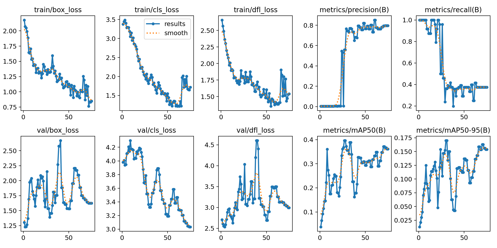
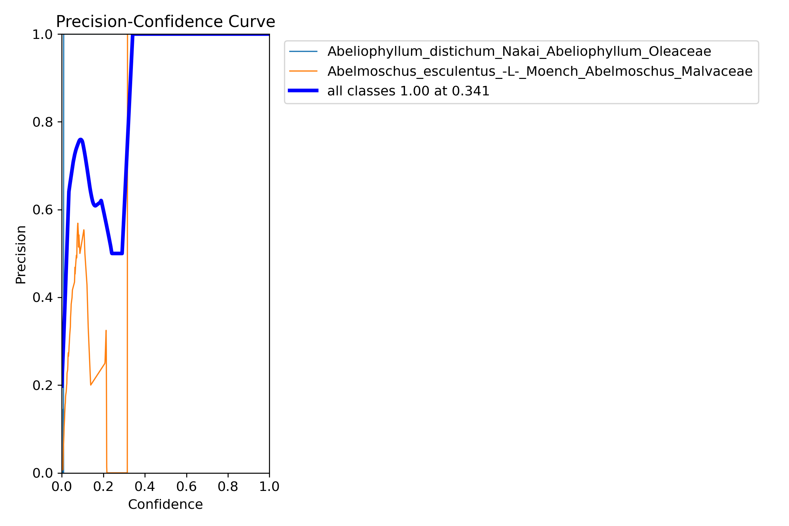

## Part 1 - Plant-classification YOLO and Kerra
Plant classification is in conjunction with the Genus-and-Species-Android-app repository. 
The plant data comes from the University of Glasgow. There are 10,001 classes of different species and genus of plants. 
Most classes have only a few to several hundred data points, making training very, very hard. 
There are several solutions forward, such as adding to the class sets which are lacking using methods such as augmentation and web crawling to gather more data, etc. 
This has worked to a certain degree, while dipping into uncertainty in solution output.
My current method is to break the data down into many trained models and somehow feed that into the application. This is yet to be explored!

Below are training results based on the models provided.

Choosing the correct model was one of the most dificult and extremly time consuming tasks for this application. Below are the results of a Keras model i uesd to traine the entire data set which would often take the night!
It is obvious the keras model here is performing poorly. Through a training routine of 60 epochs the model is attaining 1.4% accuracy.

Training validation of 10 parent chunks with 1K classes in each chunk for 60 epochs.
This includes a Dropout layer to reduce overfitting and Data augmentation. Overfitting generally occurs when there are a small number of training examples, which is what we have here!!

Yolo model identifying genus and species correctly.
The two images side by side below are 10% of the total data being trained for 50 epochs. 
Taking two species as a selection the accuracy is around certain or (100%)!
 

## Part 2 - Plant-classification Android native application
The repository is in conjunction with the YOLO-Detection (Plant-detection)repository. The TF Lite file sits within the assets of this app. When the application is running, scroll on the menu to select the correct model. I have broken them down into chunks, clumps of several hundred classes, which is the only way YOLO will detect. Too many classes cause a data insufficiency problem. As it stands currently, I cannot get multiple .tf lite models working through an overlap method in the Android application. Below is an example of the YOLO model solution which sits within this model as a TF Lite file, only a single model.

### Overview

This application was adapted using code from:
- [TensorFlow Lite Object Detection Android Demo](https://github.com/tensorflow/examples/tree/master/lite/examples/object_detection/android), and
- [Ultralytics Flutter demo app](https://github.com/ultralytics/yolo-flutter-app)

### Licences
Original TensorFlow Lite Object Detection Android Demo has [Apache License 2.0](LICENSE-Apache2.0.txt), while Ultralytics has [GNU GENERAL PUBLIC LICENSE](LICENSE).
So in case of using this code you must complain both licences.

### Application

This is a camera app that continuously detects the objects (bounding boxes and
classes) in the frames seen by your device's back camera, with the option to use
a quantized
[MobileNet SSD](https://tfhub.dev/tensorflow/lite-model/ssd_mobilenet_v1/1/metadata/2),
[EfficientDet Lite 0](https://tfhub.dev/tensorflow/lite-model/efficientdet/lite0/detection/metadata/1),
[EfficientDet Lite1](https://tfhub.dev/tensorflow/lite-model/efficientdet/lite1/detection/metadata/1),
[EfficientDet Lite2](https://tfhub.dev/tensorflow/lite-model/efficientdet/lite2/detection/metadata/1),
and [Ultralytics Yolo](https://docs.ultralytics.com/tasks/detect/#models)
model trained on the [COCO dataset](http://cocodataset.org/).

_Android Native app - work in progress_

[back](./)
