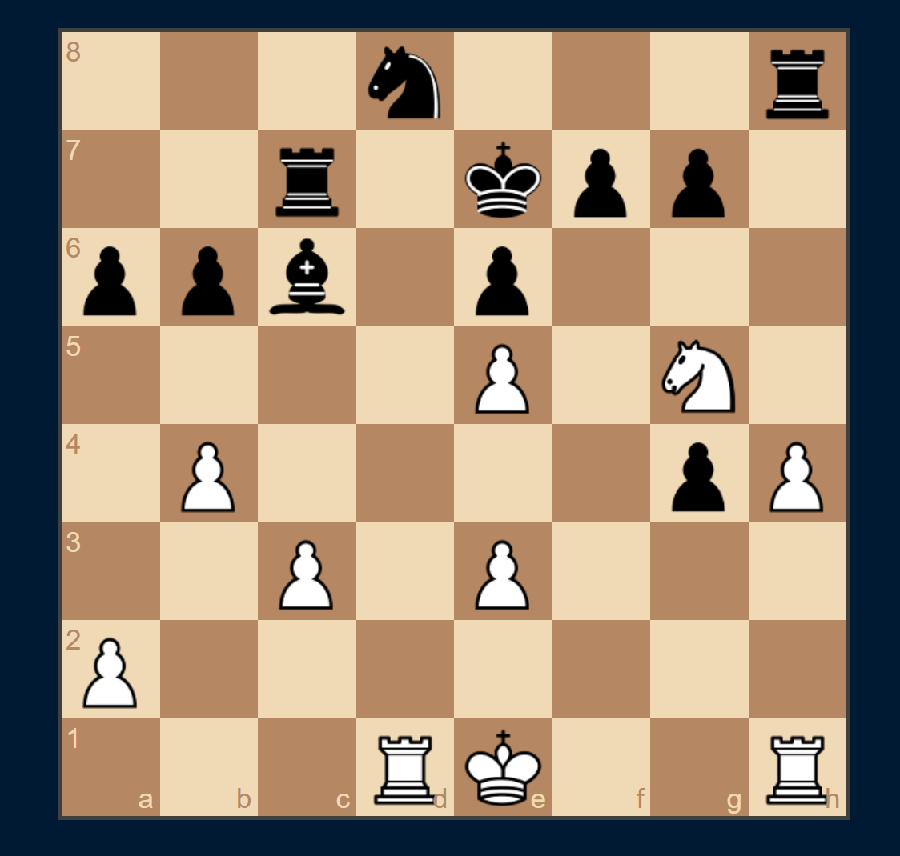

# Matilda - Robotic chess across the internet

This project incorporates mechatronic control, through a Pi5 and six servos, as seen below by the high-level schematic.
Internetworking will allow the remote player to make moves against the robot. This will be displayed by a Pi vision camera.
The chess engine will utilize the chess bots from chess.com (Stockfish) and object detection (YOLO) to 'see' pieces.

The motivation of this project is to one day play chess with my daughter Florence remotely. Roald Dahl's Matilda
inspired me as a young child, in an attempt I hope to do the same.

The files attached are the starting point for this project. 
Code and STL files, staye tuned... 

# progression list to date.
1. All items have been procured.
2. The robotic arm has been selected and alterd from the original repository. 
3. Established a 'here and there' netword using my home PC and a VM. This is to establish a internetworking connection.
4. Print the 3D printed arm and test the proto type.

# Prototyping - software
A modern frame work that may work well for data and internetworking is Flask. 
Flask will handle web requests, allowing a remote user to interact with the chess game and interface over the internet. Using Flask-SocketIO, I can implement WebSockets for real-time communication, ensuring instant moves between the player and the robot. Flask will interface with the robot arm control API to execute moves physically. The architecture will involve Flask serving the web interface and receiving move commands, which are then sent via WebSockets to the robot controller. The robot's state and moves can be streamed back to the user, ensuring synchronized play.
The diagram below, could be a great starting framework for application!

As astarting point with Flast on the front end in index.html i have usesed Chessboard.js v1.0.0 to render an interactive chessboard with draggable pieces styled via the default Wikipedia-themed set. It’s paired with chess.js for move validation and game logic. Valid player moves trigger a /move POST request to fetch and display the AI’s response move dynamically, updating the board in real time.

for app.py Flask backend powers the AI opponent using python-chess and Stockfish. User moves are validated server-side before being applied to the board. The engine responds with its best move using a low time limit and skill level for fast interaction. Communication happens via JSON through the /move endpoint, enabling real-time gameplay with legal move enforcement.

Once run the project looks similar to this

The basic highlevel schematic below will be a starting point for prototyping. This project, elctro-mechanically.
At some stage i may need to introduce a servo driver with multi-channel capability, if threading causes delays.

The Pi 5 was selected over the Pi 4 based on the new ARM Cortex-A76 CPU, allowing significant improvements in single and multi-threaded workloads. Each servo will be required to run on different threads to meet the requirements of multi-axis movement at once.
The Pi camera will run separately, hosting YOLO.

The servos are SG90 MICRO x3 and MG996R x3. These servos are divided into two groups: larger movements or macro (MG996R) and finer movements or micro (SG90 MICRO). The macro movements consist of the waist, shoulder, and elbow, while the micro movements include wrist roll, wrist pitch, and the gripper. Collectively, this gives the arm five degrees of freedom.

The capture below is the complete and updated robotic arm. 
This repository came from here: [text](https://howtomechatronics.com/tutorials/arduino/diy-arduino-robot-arm-with-smartphone-control/)

_Matilada Chess - Work in progress_

[back](./)